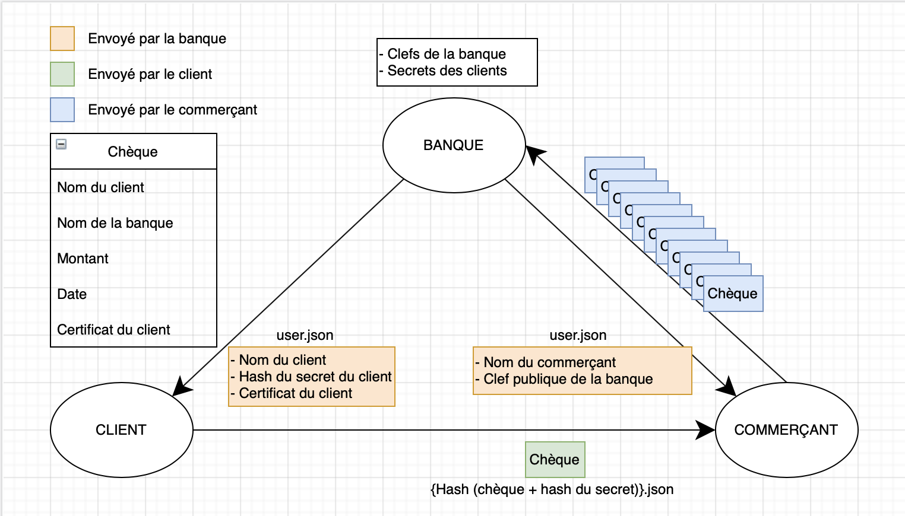

# CA-2021

## Objectif

Mise en place d'un protocole de chiffrement permettant les micro paiements bancaires, une sorte d'alternative numerique au chèque.

Les entitités impliquées sont:

- La banque
  - Créer des clients
  - Créer des commerçants
  - Encaisser des chèques
- Le client
  - Emettre des chèques
- Le commerçant
  - Vérifier la validité des chèques
  - Envoyer les chèques à la banque

Les contraintes sont:

- La banque ne communique qu'une seule fois avec le client et le commerçant, celà est fait lors de la création de ceux-ci.
- Le commerçant est sûr d'être payé lorsqu'il réçcoit un chèque
- Le client est assuré que son chèque ne sera pas modifier avant encaissement
- Un client ne peut pas faire un chèque au nom d'un autre client
- Fonctionne hors connexion

## Réalisation

Avant de vous décrire notre protocole, voici une schema du fonctionnement de notre protocole.



> Un certificat est la signature, avec la clef privée de la banque, du nom du client

### Création d'un client

Lors de la création d'un client, la banque transmet à celui-ci le fichier _user.json_ contenant:

- Le nom du client
- Le hash du secret du client généré par la banque
- Le certificat du client qui est la signature, avec la clef privée de la banque, du nom du client

### Création d'un commerçant

Lors de la création d'un commerçant, la banque transmet à celui-ci le fichier _user.json_ contenant:

- Le nom du commerçant
- La clef publique de la banque

### Emission d'un chèque par le client

Un chèque est un fichier _json_ contenant:

- Le nom du client
- Le nom de la banque
- Le montant
- La date d'émission
- Le certificat du client

Le nom du fichier transmis au commerçant est le hash du resultat de la concatenation du chèque et du hash du secret du client.

Cette façon de nommé le fichier du chèque nous permettra de savoir si le chèque a été modifié au cours de son transit vers la banque car seul le client émetteur du chèque et la banque possèdent le hash du secret permettant retrouver le nom du chèque.

### Vérification de la validité d'un chèque par le commerçant

À partir de la clef publique de la banque et du nom du client, le commerçant peut verifier la signature du client et donc s'assurer que le client émetteur du chèque est bel et bien client de la banque. Aussi le commerçant vérifie qu'il est le destinataire du chèque.

### Envoi des chèques à la banque

Tous les chèques valides sont envoyés à la banque.

### Encaissement d'un chèque par la banque

À partir du secret du client émetteur du chèque et du chèque, la banque peut reconstituer le nom du chèque (le hash du resultat de la concatenation du chèque et du hash du secret du client).
Si cette reconstitution est réussie alors le chèque est valide car la banque est sûre que le chèque n'a pas été modifié depuis l'émission du chèque par le client.

## Utilisation du programme

### banque

Dans le dossier banque, lancez les commandes suivantes:

- Création d'une banque
  ```sh
  $ ./main init
  ```
- Suppression d'une banque
  ```sh
  $ ./main clean
  ```
- Création d'un client
  ```sh
  $ ./main client <nom du client>
  ```
- Création d'un commerçant
  ```sh
  $ ./main client <nom du commerçant>
  ```
- Vérification des chèques
  ```sh
  $ ./main verify
  ```
  > Les chèques acceptés seront dans les dossier _accepted_ et les autres dans le dossier _rejected_

### client

Dans le dossier client, lancez les commandes suivantes:

- Émission d'un chèque
  ```sh
  $ ./main -amount <montant> -to <commerçant>
  ```
  > Les chèques seront dans le sous dossier _checks_ du dossier _shop_
- Obtenir de l'aide
  ```sh
  $ ./main -h
  ```

### commerçant

Dans le dossier shop, lancez les commandes suivantes:

- Initialisation
  ```sh
  $ ./main init
  ```
- Suppression des dossiers créés lors de l'initialisation

  ```sh
  $ ./main clean
  ```

- Vérification des chèques

  ```sh
  $ ./main verify
  ```

  > Les chèques acceptés seront dans les dossier _accepted_ et les autres dans le dossier _rejected_

- Envoi des chèques
  ```sh
  $ ./main send
  ```
  > Les chèques seront dans le sous dossier _checks_ du dossier _bank_
